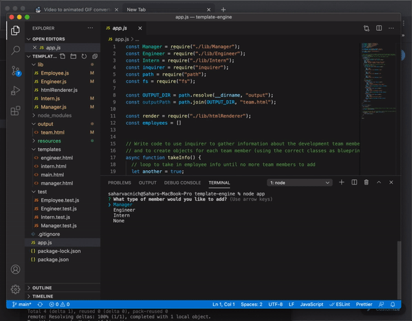

# Employee Template Engine
  

  ## Description
  A Node CLI taking employee information to dynamically generate an HTML page displaying a summary for each employee

  ## Languages
  JavaScript, HTML

  ## Table of Contents
  - [Installation](#Installation)
  - [Credits](#Credits)
  - [Usage](#Usage)
  - [Questions](#Questions)
  - [License](#License)

  ## Installation
  clone the repo, run "npm install", run "node index"

  ## Credits
  Sahar Vacnich

  ## Usage
  Follow instructions in command line filling employee info. Once done, the resulting HTML will generate in output folder

  ## Testing
  run "npm run test"

  ## Questions
  [link to my GitHub!](https://github.com/saharVac)
  [Email me!](mailto:vcsahar@gmail.com)
  

  ## License
  None

